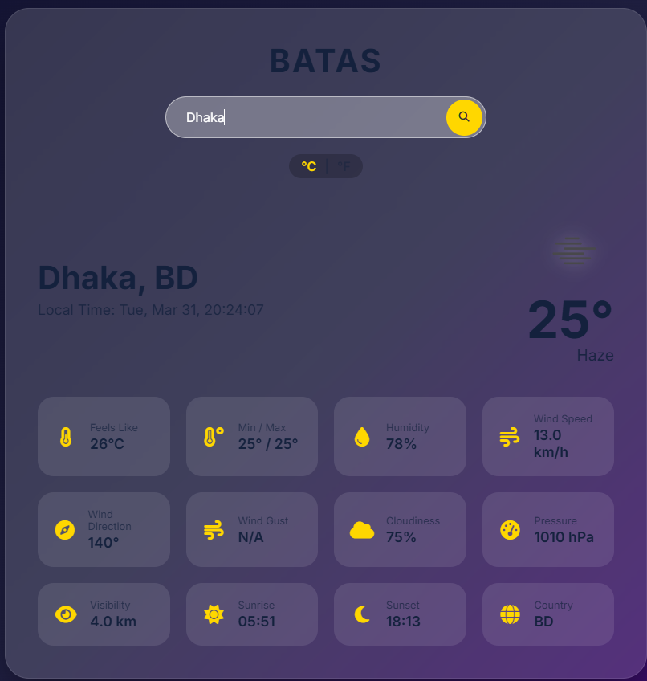
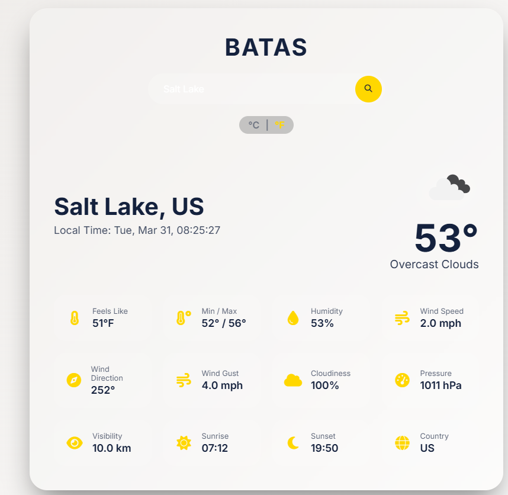
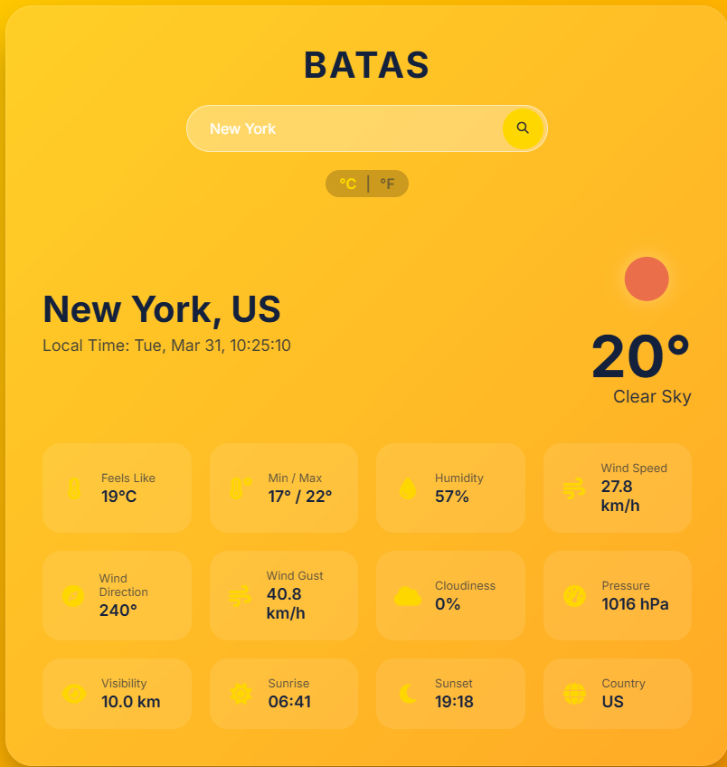
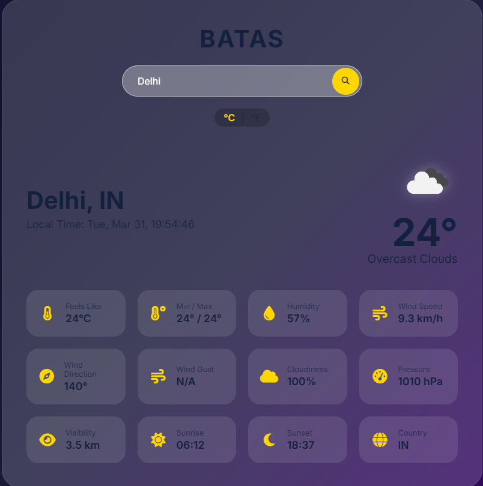

# 🌬️ Batas – Weather App

Batas is a modern, responsive weather application that lets users check real-time weather information for any city using the OpenWeatherMap API. The app shows detailed weather data including temperature, humidity, wind, sunrise/sunset, and local time.

---

## 🔹 Features

- Search weather by city name  
- Displays:  
  - Temperature & “Feels Like”  
  - Min & Max Temperature  
  - Humidity  
  - Wind Speed, Direction & Gusts  
  - Cloudiness (%)  
  - Atmospheric Pressure  
  - Visibility  
  - Weather Description  
  - Sunrise & Sunset Time  
  - Country Code  
  - Live Local Time of the city  
- Celsius ↔ Fahrenheit toggle  
- Automatic location detection  
- Save last searched city in localStorage  
- Loading spinner while fetching data  
- Responsive design for desktop and mobile  
- Weather icons and dynamic background depending on weather  
- Press Enter to search  

---

## 🔹 Demo / Screenshot

Here’s a preview of the app in action:

!




> Replace `screenshot.png` with your actual screenshot file name and place the image in your project folder.  
> You can also put it in an `assets/` folder like `assets/screenshot.png` and update the path accordingly.

---

## 🔹 Installation / Run Locally

1. **Clone this repository:**
   ```bash
   git clone https://github.com/yourusername/batas-weather-app.git
